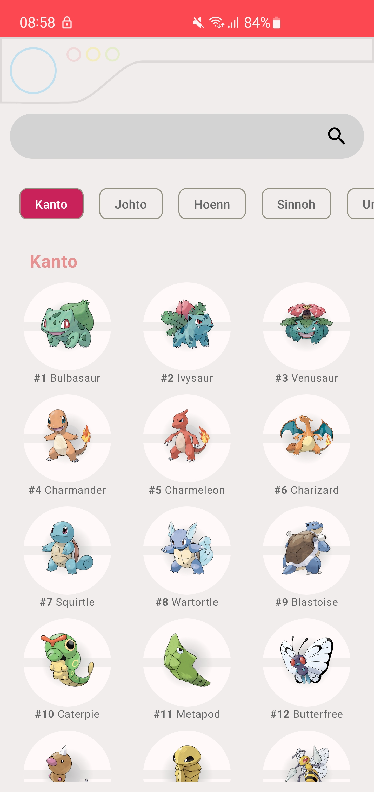
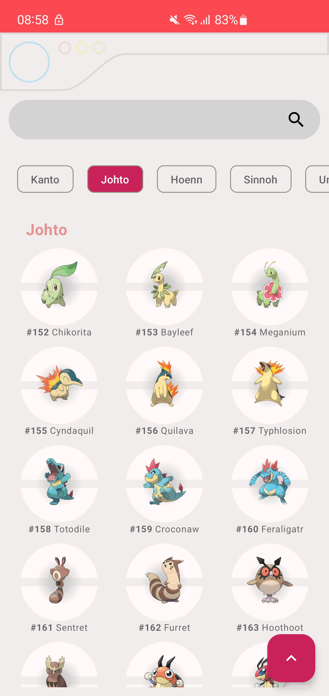
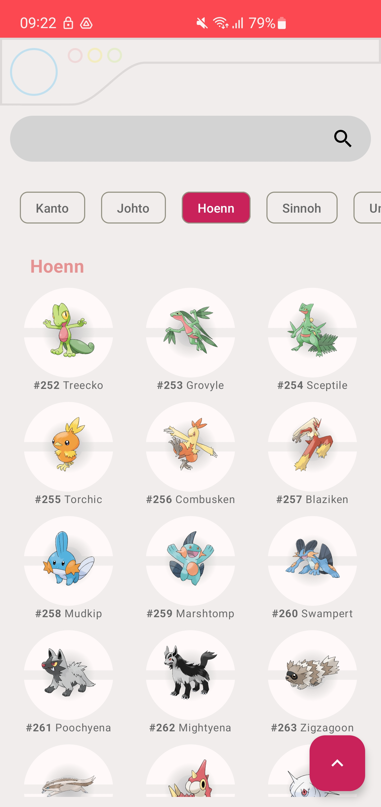
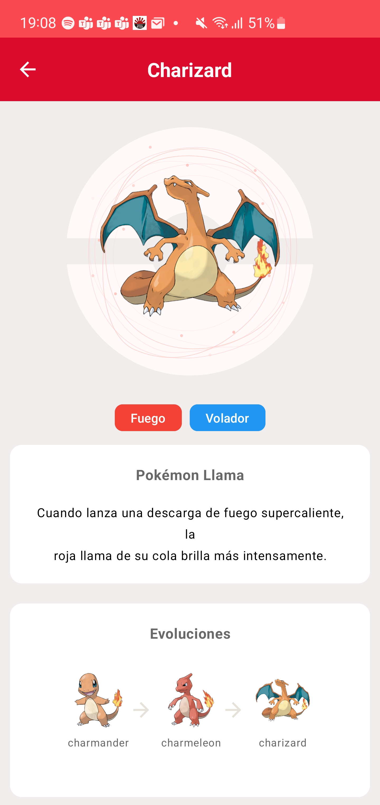
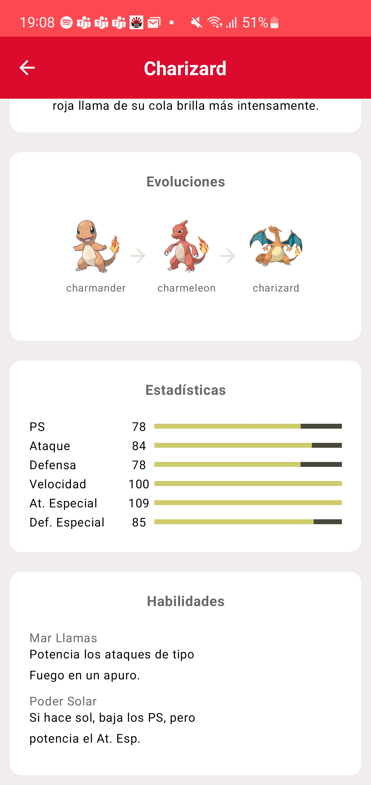

## Desarrollador Esteban Machuca

## Sobre la App
    Aplicación Pok3Search tipo Pokedex.
    Lista todos los pokemones agrupados por región, opciones de búsqueda por nombre o número de pokedex de Pokémon y filtros por región.
    Muestra detalles de pokémon, imagen, descripción, cadena evolutiva, estadísticas y habilidades

    •	Api consumido: PokeAPI v2.
    •	Idioma: español.
    •	Requisitos mínimos para su instalación: Smartphone con sistema operativo Android 7.0 Nougat (nivel de API 24) o superiores.

## Proyecto
    En el proyecto se utiliza:
        •	Lenguaje de programación Kotlin versión 1.7.0
        •	Jetpack Compose versión 1.2.0
        •	Navigation Compose versión 2.5.1
        •	Material 3 versión 1.0.0-alpha11
        •	Patrón de desarrollo MVVM
        •	Coroutines Flows
        •	LiveData versión 1.5.1
        •	Principios SOLID y Clean Architecture
        •	Persistencia de datos con ORM Room versión 2.5.0
        •	Inyección de dependencias con dagger hilt versión 2.44
        •	Peticiones HTTP con Retrofit 2 versión 2.9.0
        •	Librería de carga de imagenes coil-compose versión 2.4.0
        •	Animaciones con lottie-compose versión 4.2.0

    Compilación
        •  compileSdk 34

## Vista Previa de App

Splash Screen

 

  

Listado de Pokemones Agrupado por Regiones

    

  

Detalles de Pokémon - Imagen, tipo, descripción y cadena evolutiva de Pokémon

 

  

Detalles de Pokémon - Estadísticas y habilidades

 

  

Demostraciones

Filtro por región y detalle de Pókemon

  iltro por region)](https://youtube.com/shorts/mgIgroBtAos?feature=share)